# Spinlayden 2.0

## Team Meltdown — Riverside Robotics

**Riverside High School** · 585 Riverside Dr, Painesville, OH 44077

**AWT Regional RoboBots Competition — 2025–2026 Season**

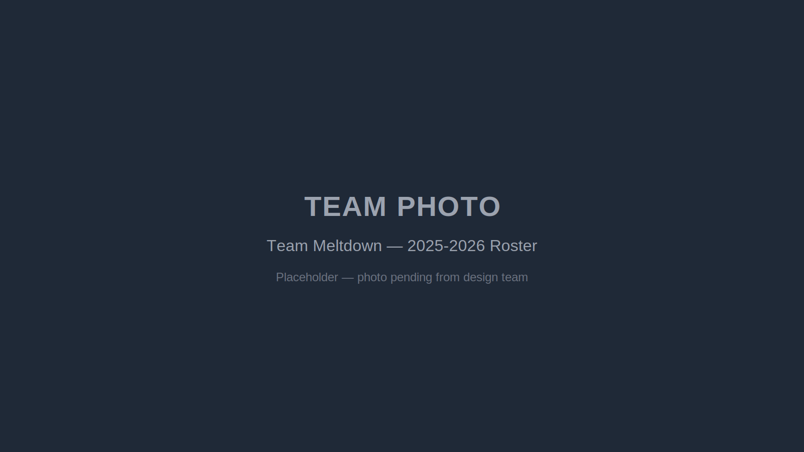

*Team Meltdown — 2025-2026 roster (photo pending).*

### Team Members

| | | |
|---|---|---|
| Adam Pakeltis | Alexander Holmes | Ayden Moore |
| Benjamin Mackey | Daniel George | Dustin Hance |
| Jason Kellhofer | Jayden Craig | Kasey Kurzinger |
| Kaydan Kerr | Lukas Dauksa | Mher Poghosyan |
| Robert Rateno | Richard Rowland | Sultan Kazeem |
| Tom Kramer | Vincent Riha | Xayden Minch |
| Yash Jain | | |

**Advisors:** Jack Carbone, Adam Carbone &nbsp;·&nbsp; **Industry Advisor:** J.T. Mackey (Monode Marking Products, Inc.)

**Sponsors:** Monode Marking Products, Inc. &nbsp;·&nbsp; Show Studio LLC &nbsp;·&nbsp; Arc Technology LLC

---

# Spinlayden Riverside Robotics

**School:** Riverside High School
**Address:** 585 Riverside Dr, Painesville, OH 44077

**Advisors:** Jack Carbone, Adam Carbone
**Industry Advisor:** JT Mackey

**Team Members:**

- Adam Pakeltis
- Alexander Holmes
- Ayden Moore
- Benjamin Mackey
- Daniel George
- Dustin Hance
- Jason Kellhofer
- Jayden Craig
- Kasey Kurzinger
- Kaydan Kerr
- Lukas Dauksa
- Mher Poghosyan
- Robert Rateno
- Richard Rowland
- Sultan Kazeem
- Tom Kramer
- Vincent Riha
- Xayden Minch
- Yash Jain

---

## Meet the Robotics Team

**Overview:** Since 2022, Riverside High School had been without a robotics team. Former Class of 2023 students, Adam and Jack Carbone, took the opportunity to establish one. In just four months, from January to April, not only was a team formed, but Riverside Robotics also learned to design and manufacture its first robot in years, Spinlayden. This year, the high school roster has grown to 19 students on Team Meltdown, with two additional JuniorBots middle-school teams also running under advisors Jack and Adam Carbone.

**2026 Design:** Spinlayden 2.0 is the team's second-generation 15-pound hexagonal meltybrain full-body spinner, built around a 6061 aluminum chassis with six 1/2" carbon steel hex bolts as impact weapons and driven by dual BaneBots P61 gearboxes at 645.6 RPM (≈26.9 mph tip speed, ~78 J per rotation). This season's redesign focuses on the failure points identified from Spinlayden 1.0 — reinforcing the chassis walls, redesigning the gearbox and bearing mounts for easier serviceability and better belt tension, and moving the meltybrain control software from Python to C# on a Raspberry Pi for tighter simultaneous-rotation-and-translation drive control.

---

## Table of Contents

- [About Riverside](#about-riverside)
- [Our Partners](#our-partners)
- [Team Biographies](#team-biographies)
- [Mentor / Advisor Biographies](#mentor--advisor-biographies)
- [Acknowledgements](#acknowledgements)
- [Design](#design)
  - [Influences](#influences)
  - [Key Stats of the Bot](#key-stats-of-the-bot)
  - [What Was Changed from the Previous Design](#what-was-changed-from-the-previous-design)
- [Project Overview](#project-overview)
  - [General Information](#general-information)
  - [Sponsors](#sponsors)
  - [Advisors](#advisors)
  - [Manufacturing](#manufacturing)
  - [Bot Description](#bot-description)
  - [Objective](#objective)
  - [Team Members](#team-members)
  - [Deliverables](#deliverables)
  - [Key Milestones](#key-milestones)
  - [Constraints / Risks / Dependables](#constraints--risks--dependables)
- [Team Meltdown - Tasks Distribution](#team-meltdown---tasks-distribution)
  - [Project Assignments](#project-assignments)
- [Team Procedures](#team-procedures)
  - [Material Management](#material-management)
  - [Our Component Philosophy](#our-component-philosophy)
  - [Fabrication](#fabrication)
  - [Inventory](#inventory)
- [Design Process](#design-process)
  - [Research](#research)
  - [Strategy](#strategy)
  - [Analysis and Conceptualization](#analysis-and-conceptualization)
  - [Design Motivation](#design-motivation)
  - [Research Methods](#research-methods)
  - [Risk Analysis](#risk-analysis)
  - [Structural Analysis](#structural-analysis)
  - [Weapon System Details](#weapon-system-details)
  - [Drive System Details](#drive-system-details)
  - [Power System Details](#power-system-details)
  - [Wiring Schematic](#wiring-schematic)
  - [Testing Results](#testing-results)
- [That's a Wrap!](#thats-a-wrap)

---

## About Riverside

Riverside High School is a public high school located in Painesville, Ohio, serving the communities of Painesville Township, Concord, Leroy, and Grand River in Lake County. Part of Riverside Local Schools, the district holds true to its mission of providing A Pathway to Excellence by immersing students in educational opportunities that prepare them for success in college, careers, and beyond. Riverside strives to develop well-rounded individuals who are proactive in their communities and equipped with the skills necessary to thrive in a rapidly evolving world.

Connecting with this commitment to excellence, Riverside Robotics encourages hands-on learning, creative problem-solving, and independent thinking—qualities that are essential both in the arena and in life. Advised by Jack Carbone and Adam Carbone, both Class of 2023 alumni who returned to volunteer their time, Riverside Robotics aims to uphold the school's mission through the range of experiences in which students participate.

Riverside Robotics has a rich history dating back to the 2010s, competing in the AWT RoboBots program at Lakeland Community College—Ohio's largest regional combat robotics competition and a National Robotics League sanctioned event. In 2021, the team earned third place with Pfizer and Moderna, a pair of weaponless wedge bots designed around a strategy of control, domination, and superior torque. The following year, the team fielded Mass and Acceleration, a non-uniform dual-bot entry featuring both spinner and wedge designs, demonstrating the program's continued commitment to innovation and experimentation.

Following a brief hiatus, Riverside Robotics was revived in 2025 when alumni advisors Jack and Adam Carbone returned to reestablish the program. In just four months, from January to April, not only was a team of eight students formed, but Riverside Robotics also learned to design and manufacture its first robot in years: Spinlayden, a 15-pound meltybrain full-body spinner. Although competition results were modest, the inaugural revival season proved to be an overwhelming success—a year defined by excitement, growth, and invaluable learning experiences for every member of the new team.

At Riverside, the robotics program has achieved significant success beyond the arena. Alumni of the program have gone on to pursue degrees in mechanical engineering, software engineering, and other engineering disciplines at colleges and universities. Through robotics, students gain exposure to real-world manufacturing skills, CAD design, electronics, and the iterative process of engineering—experiences that have shaped their academic and professional futures.

The 2025-2026 season marks a historic expansion for Riverside Robotics. The high school competition team, Team Meltdown, has grown to 19 students fielding Spinlayden 2.0, an evolved iteration of the meltybrain spinner. Alongside the high school team, the JuniorBots program was revived from scratch this year, with two middle school teams—Team Pickle Pirates competing with The Pickler, a horizontal spinner, and Team Tornadoes bringing The Tempest to the arena. Each JuniorBots team boasts 15 to 20 students, a testament to the growing enthusiasm for robotics throughout the district.

The goal of Riverside Robotics is not only to compete at the highest level, but also to spread the joy of engineering and instill valuable skills applicable in the real world. Through teamwork and collaboration, students learn how to support each other, solve complex problems under pressure, and transform ideas into reality. This aligns closely with Riverside's mission of providing a pathway to excellence, and embodies a spirit of innovation, leadership, and perseverance.

---

## Our Partners

Riverside Robotics is proud to partner with local businesses and organizations that share our commitment to inspiring the next generation of engineers and innovators. Their generous support makes our program possible.

### Monode Marking Products, Inc.

Monode Marking Products, Inc. is an American manufacturer specializing in permanent part-marking and traceability solutions for industrial applications. As a third-generation, family-owned business celebrating 75 years in the marking industry, Monode has built its reputation on delivering practical, reliable solutions that perform in real-world environments.

Headquartered in Mentor, Ohio, Monode maintains a strong focus on North America while serving customers worldwide across industries including the Department of Defense, aerospace, automotive, medical, and food and drug sectors. The company provides a full range of marking technologies, including laser, dot peen, electro-chemical etching, steel stamp, and high precision die systems, along with integrated machine vision solutions.

What sets Monode apart is its focus on the complete system—not just the marking device. By combining marking hardware, proprietary software, and system integration with existing customer workflows, Monode delivers solutions that are reliable, scalable, and built for long-term use. Their team works closely with customers to design, implement, and support turnkey systems that meet production demands while ensuring compliance with requirements such as DoD Item Unique Identification (IUID).

Beyond equipment, Monode provides consulting, system design, installation, training, and ongoing support to ensure customers achieve consistent performance and long-term value. This practical, full-system approach has made Monode a trusted partner for organizations that depend on accurate, repeatable, and fully traceable marking solutions.

If you would like to learn more about Monode Marking Products, we encourage you to visit: https://www.monode.com/

### Arc Technology LLC

Arc Technology LLC is an electronics and engineering company founded in 2025 by Riverside Robotics advisor Adam Carbone. Based in Cleveland, Ohio, Arc Technology designs, develops, and delivers innovative products across engineering, electronics, and emerging technologies. Their flagship product, the FPV Sim Link, is a patent-pending device that converts HDMI to 5.8GHz RF for FPV drone simulator training. Arc Technology provides financial support to help sustain and grow the robotics program.

### Show Studio LLC

Show Studio LLC is a software company founded in 2025 by Riverside Robotics advisor Jack Carbone. Inspired by Riverside High School's own Riverside Regiment marching band, Show Studio develops marching band drill design software delivered as a Software-as-a-Service platform. The software features 3D visualization and coordinate generation tools to help band directors and designers bring their creative visions to life. Currently in beta, Show Studio provides Riverside Robotics with funding, 3D printers, portable CNC mills, and other materials essential for robot fabrication.

Through the combined support of our partners, Riverside Robotics is able to offer students access to professional-grade resources, real-world manufacturing experience, and mentorship that prepares them for careers in engineering and technology.

---

## Team Biographies

**Adam Pakeltis:** This hardworking senior is thrilled to join Team Meltdown for his very first year. Alongside robotics, Adam has played football and is an active member of the National Honor Society. Outside of the cage, this first-time competitor stays incredibly busy. He volunteers for both NHS and the Lake Metroparks, works weekends at Hellriegel's Inn, lifts weights, fishes, and enjoys working outside. When he isn't building plastic model kits or designing projects in Fusion 360, he loves hanging out with his girlfriend and watching "Deal or No Deal" with his family. This well-rounded student is more than ready to bring his diverse skills to the team and experience his first competition.

**Alexander Danger Holmes:** Returning for his second year, this sharp junior is ready to take the competition by storm. Bringing his strategic mindset to the team, Alexander takes charge of marketing operations. Along with robotics, he is actively involved in Accounting and Model UN. When he isn't busy promoting the team, he enjoys reading, following F1 racing, and competing in fencing. With a middle name like Danger, this experienced student is definitely prepared to help his team stand out and succeed.

**Ayden Moore:** This returning junior is back and ready to conquer the cage for his second competition. As the team's all-around helper, Ayden is actively involved in Robotics, Esports, and NTHS. Outside of school, he enjoys programming, exercising, watching TV, and playing video games. This versatile competitor is eager to take the wheel to drive a bot and watch it win.

**Benjamin Mackey:** This enthusiastic eighth grader is thrilled to step into the cage for his very first year. At 14 years old, Ben brings a positive attitude and a strong love for math to the team. Always happy to help and ready for a challenge, this cheerful rookie is excited to calculate the team's path to victory and gain valuable experience in his first competition.

**Daniel George:** This talented junior is stepping into the cage for his very first time. Daniel brings his skills to both the mechanical and documentation sides of the team. He is actively involved in robotics, Model UN, and marching band. Outside of school, he enjoys skiing and teaching others on the slopes, playing the saxophone, drawing, and conquering *Dark Souls*. This dedicated student is eager to dive into the competition and gain valuable experience this season.

**Dustin Hance:** Returning for his second year on the Riverside robotics team, this junior brings a strong passion for computers, networking, cybersecurity, and programming. On the software team, Dustin has been central to keeping Spinlayden 2.0's Raspberry Pi running — setting up the headless OS, managing dependencies, and pulling the team's latest code from GitHub throughout the season. In his free time, he enjoys playing video games and tinkering with his personal homelab. This tech-savvy competitor is ready for the season and is mostly just hoping the software he "vibecoded" actually works!

**Jason Kellhofer:** This aspiring freshman steps into the arena for his first ever competition! Jason Kellhofer brings a dedicated mindset to the team, focusing on maintaining precise documentation and completing any tasks assigned to him. He consistently pushes himself academically by tackling a full schedule of honors classes, showcasing his drive for excellence. Outside the classroom, Jason likes to play wiffleball and diving into computer systems to expand his knowledge. This proactive competitor is eager to see how his and his team's skills combine to ensure a secured win this season.

**Jayden Craig:** This experienced sophomore returns to the arena for his second year with Team Meltdown. Coming in with a year of firsthand experience on the Spinlayden project, Jayden hits the ground running with a working knowledge of the design, and has contributed across mechanical design, CAD modeling, marketing, manufacturing, and assembly. His versatility makes him a reliable presence anywhere on the team. This returning competitor is eager to put his experience to work and help bring Spinlayden 2.0 across the finish line.

**Kasey Kurzinger:** This enthusiastic eighth grader steps into the arena for his very first competition! Kasey has jumped in headfirst as a first-year member, contributing to CAD design, documentation, manufacturing, and assembly alongside his teammates. His quick learning and willingness to take on any task have made him a valuable addition to the team. This eager rookie is ready to see how his hard work comes together in the arena.

**Kaydan Kerr:** This eager eighth grader steps into the cage for his very first competition! Kaydan came to Team Meltdown with a genuine interest in robotics and battle bots, and has channeled that enthusiasm into real contributions — overseeing design and specification decisions and jumping in wherever needed during assembly. With a sharp eye for how the robot should come together, he brings both curiosity and commitment to the team. This first-year competitor can't wait to see Spinlayden 2.0 in action.

**Lukas Dauksa:** This hardworking junior steps into the arena for his very first competition! Lukas brings hands-on energy to the team's electrical work, contributing to the spec and design process and pitching in during assembly to help keep the build moving forward. His willingness to get involved and learn on the fly has made him a reliable team member throughout the season. This first-year competitor is ready to see what the team has built take the stage.

**Mher Poghosyan:** This dedicated junior steps into the cage for his very first competition! Mher has contributed to both the documentation and mechanical sides of the team, bringing careful attention to detail to spec and design discussions while pitching in during assembly to move the build forward. His ability to bridge the gap between documentation and hands-on work has made him a versatile and dependable presence on the team. This first-year competitor is excited to see everything come together in the arena.

**Richard Rowland:** This energetic eighth grader steps into the arena for his very first competition! Richard has been fully hands-on all season, contributing to spec and design discussions and jumping in during assembly to help bring Spinlayden 2.0 to life. His willingness to learn, adapt, and take on whatever is needed has made him a dependable part of the team. This first-year competitor is ready to see what he and his teammates have worked so hard to build.

**Robert Rateno:** This returning sophomore is ready to hit the cage for their second competition. As the team's driver, they are prepared to take the wheel and steer the robot to victory. Alongside robotics, this student keeps the beat in the school's marching band. Outside of school, they enjoy playing the drums, 3D printing, and tinkering with RC vehicles. This experienced competitor is excited to show off their driving skills and dominate the competition.

**Sultan Kazeem:** This bright junior is stepping into the cage for his very first time. Bringing his skills to the mechanical team, Sultan is excited to win at competition. He is actively involved in Model UN, Academic Challenge, choir, and Investment Club. When not building robots, he enjoys bike riding. This hardworking student cannot wait to dominate.

**Tom Kramer:** This brilliant junior has traveled all the way from Germany to show the competition what he is made of! As a foreign exchange student at Riverside, Tom is more than ready to make his mark in robotics. On the team, he is the mastermind behind the screen, specializing in software and keeping the team's documentation in perfect order. Outside of prepping the robot for battle, this tech-savvy student spends his free time coding and learning everything he can about computers. This dedicated programmer is excited to show off his skills and help lead the team to victory.

**Vincent Riha:** This talented sophomore steps into the arena for his very first competition! Vincent brings software skills to the team, contributing to the spec and design process and pitching in during assembly to support the build. His technical background and hands-on approach have made him a valuable first-year addition to Team Meltdown. This newcomer is ready to put the team's work to the test in the arena.

**Xayden Minch:** This ambitious freshman is stepping into the arena for his very first competition! Xayden brings a versatile set of skills to the team, where he focuses on maintaining detailed documentation and tackling any miscellaneous tasks needed to keep the project moving forward. A dedicated member of the school band, he stays just as busy outside the classroom. Whether he is playing the flute, building computers from scratch, coding, or diving into video games, he is always exploring the world of technology. This proactive competitor is eager to contribute his technical talents and help the team achieve a successful season.

**Yash Jain:** This 15-year-old freshman brings his Python programming skills and a love for electrical work to the team. Though he jokingly describes himself as "tired and extremely idiotic," Yash is a great sport who keeps everyone laughing. Whether he is wiring the robot or writing code, he is a dedicated member — even if the team's running joke is that whenever something goes wrong, "it's always Yash's fault!"

## Mentor / Advisor Biographies

**Adam Carbone — Co-Advisor:** Adam Carbone is an electrical engineering student at Cleveland State University and an intern at NASA Glenn Research Center, where he has spent seven semesters contributing to lunar power application projects, progressing from Regenerative Fuel Cell systems to Fission Surface Power, and moving next into 3-phase motor controller design for cryogenic cooling systems on lunar and Martian reactors. He is the founder of Arc Technology, a hardware startup with a product currently launching on Kickstarter, and a co-sponsor of the AWT RoboBots program alongside his brother and fellow advisor, Jack Carbone. As an advisor for AWT RoboBots, Adam contributes across CAD and mechanical design in Autodesk Fusion, custom PCB design and soldering, C# software development, and electrical systems including component selection and device communications. He is committed to giving students the kind of hands-on experience, direct mentorship, and real engineering exposure that sets them up to build, problem-solve, and grow well beyond the classroom. Adam and Jack revived the AWT RoboBots program in 2025 after a multi-year hiatus, growing it from a small remaining group of dedicated students into a thriving organization spanning both high school and middle school teams. For Adam, the program is an investment in the next generation of engineers, and a chance to give students the support, resources, and guidance to do something real.

**Jack Carbone — Lead Advisor:** Jack Carbone is a software developer and the founder and CEO of Show Studio LLC. As Lead Advisor of Riverside Robotics, Jack oversees all club operations and contributes across software development in C# and .NET, CAD design, and hands-on bot manufacturing. Alongside his brother and co-advisor, Adam Carbone, he revived the Riverside Robotics program in 2025 after a multi-year hiatus, growing it from a small group of students into a thriving organization spanning both high school and middle school teams. For Jack, Riverside Robotics is an investment in the future of engineering in software and hardware and, by extension, the future of humanity. He is committed to giving students the hands-on experience, financial backing, and guidance he never had access to, preparing the next generation of engineers to lead, innovate, and shape the world across every discipline the field has to offer.

**J.T. Mackey — Industry Advisor:** J.T. Mackey is a leader at Monode Marking Products, Inc., where he focuses on delivering practical, real-world solutions for industrial marking and traceability. A recognized subject matter expert, he has co-authored ANSI, ISO and military standards and currently serves as Chair of MH10.8.2, helping guide industry standards across multiple sectors. J.T. is also a patent holder and works closely with customers to ensure marking systems integrate effectively into production environments with a focus on reliability and long-term performance. Outside of work, he is deeply committed to his family—his wife Jenn and their children, Ben and Abby—and to his community. He is proud to support Monode's partnership with the Riverside robotics program, where his son Ben is a team member, helping inspire the next generation of engineers.

## Acknowledgements

Team Meltdown would like to thank everyone who has contributed to making the Spinlayden 2.0 project possible this season. The success of our team is built on the generosity, expertise, and encouragement of the people and organizations around us.

First and foremost, we would like to thank our industry sponsor, **Monode Marking Products, Inc.**, and its President, **J.T. Mackey**, for providing Riverside Robotics with shop access for machining, mentorship from professional engineers, and funding for materials. Monode's willingness to open their facility to our team and share their manufacturing expertise has been instrumental in bringing Spinlayden from a CAD model to a competition-ready robot. J.T.'s guidance as our Industry Advisor has given our students invaluable exposure to real-world engineering practices.

We would also like to thank **Arc Technology LLC**, founded by our advisor **Adam Carbone**, and **Show Studio LLC**, founded by our advisor **Jack Carbone**, for their financial support and material contributions to the program. Show Studio's donation of 3D printers, portable CNC mills, and other fabrication equipment has given our team access to manufacturing capabilities that would otherwise be out of reach for a high school program. Arc Technology's funding has helped sustain and grow the robotics program during this critical expansion year.

A special thank you to our advisors, **Jack Carbone** and **Adam Carbone**, both Class of 2023 alumni who returned to Riverside to rebuild the robotics program from the ground up. Their dedication to this team goes far beyond what is expected — from organizing meetings and coordinating with sponsors to mentoring students through every stage of the design, manufacturing, and documentation process. Without their leadership, Riverside Robotics would not exist in its current form.

We are grateful to **Riverside High School** for purchasing parts and materials for our robot and for providing the space, time, and institutional support needed to run a competitive robotics program. The school's commitment to hands-on STEM education has made it possible for our students to gain skills in engineering, manufacturing, and project management that will serve them well beyond the arena.

We would like to thank **Case Western Reserve University's think[box]** makerspace for providing access to their OMAX 5555 waterjet cutter. The precision and capability of their equipment allowed us to fabricate our hexagonal chassis plates to exact specifications — a critical step in our manufacturing process that would not have been possible without their facility.

Thank you to the **Alliance for Working Together (AWT)** for organizing the Regional RoboBots Competition. AWT's commitment to fostering the next generation of skilled manufacturing professionals gives programs like ours a platform to learn, compete, and grow.

Finally, we would like to extend our gratitude to the **parents, families, and community members** of Riverside Robotics. Your support — whether through transportation, encouragement, patience during late build sessions, or simply believing in what your students are building — makes all of this possible. Robotics is a team effort that extends well beyond the students in the room, and we are thankful for every person who has cheered us on this season.

*The 2026 Riverside Robotics team shirt — listing every member across Team Meltdown (Spinlayden), Team Pickle Pirates (The Pickler), and Team Tornadoes (Tempest).*

---

## Design

The Design section documents how Team Meltdown arrived at Spinlayden 2.0, starting from the lessons learned on Spinlayden 1.0 and the broader survey of meltybrain full-body spinners covered in the Influences section above. Our overall design philosophy this season was *iterate, don't reinvent*: the 1.0 chassis proved the hexagonal meltybrain concept was competition-viable, so rather than discard that work we systematically identified the points where 1.0 underperformed — blade retention, weapon energy, motor stall margin, control-loop stability, and serviceability — and addressed each one in 2.0.

The 2.0 design is also built around a core combat strategy: maintain distance from opponents while the chassis ramps up to full weapon speed, then engage once the full kinetic energy of the spin is available. Because Spinlayden is a full-body spinner, the chassis itself is the weapon — every impact bolt around the perimeter becomes a strike surface once the robot reaches operational RPM. This strategy places significant demand on the driver, who must fluidly transition between **wheel mode** (pure translational driving for positioning and evasion) and **melty mode** (simultaneous rotation and translation for engagement), and maintain awareness of the robot's readiness at all times.

Primary design decisions for Spinlayden 2.0 were led by students **Adam Pakeltis** and **Robert "Robby" Rateno**, with advisor **Adam Carbone** reviewing and approving each major design choice. This arrangement allowed the student designers to drive the creative and technical direction of the project while ensuring every decision was validated against engineering best practices and competition requirements before being committed to manufacturing.

The subsections that follow describe the previous bot in detail, the concrete strengths we preserved and weaknesses we corrected, and the resulting 2026 design with its key stats, CAD renders, and dimensioned engineering drawings.

**Previous Bot: Spinlayden 1.0 — 2024 - 2025 Season**

Spinlayden 1.0 was Riverside Robotics' first meltybrain full-body spinner, designed and built by an eight-member team during the 2024–2025 season under advisors Jack Carbone and Adam Carbone, with industry advisor Jeffrey Clarke. The robot featured a 14" × 12" hexagonal chassis machined from 1/8" 6061-T6 aluminum with vent-like weight reduction cutouts. Six A516 Grade 70 carbon steel blades, totaling 38 oz, were mounted around the perimeter. Powered by REV UltraPlanetary gearmotors and controlled by a Raspberry Pi 4B running Python-based meltybrain algorithms, the bot achieved a rotational speed of 645.6 RPM and delivered approximately 78 joules of kinetic energy per rotation within the 15 lb weight class.

The double-sided design allowed the robot to operate when inverted, eliminating the need for a self-righting mechanism. Spinlayden 1.0 proved the viability of the hexagonal meltybrain concept for the AWT competition and provided returning team members with direct experience in full-body spinner design, fabrication, and competition strategy.

*Figure 1: Spinlayden 1.0 — Isometric CAD Render. CAD: Design Team (2024–2025 roster archive).*

*Figure 2: Spinlayden 1.0 — Top-Down CAD Render showing hexagonal chassis, six perimeter blades, dual drive wheels, and central Raspberry Pi housing. CAD: Design Team (2024–2025 archive).*

*Figure 3: Spinlayden 1.0 — Physical bot following the 2025 competition, featuring the Riverside Robotics logo painted on the chassis. Photo: Riverside Robotics archive (2024–2025 season).*

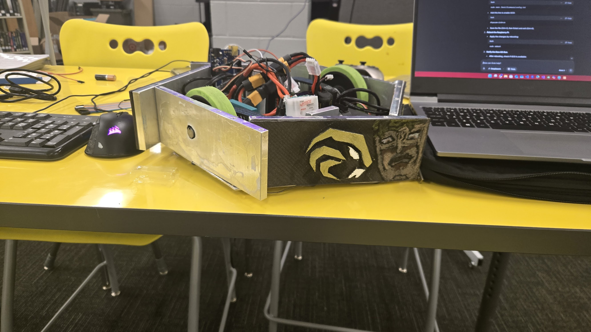

**Strengths:**
- Hexagonal full-body spinner concept validated for competition
- Meltybrain drive system enabling simultaneous rotation and translation
- Double-sided chassis design for invertibility
- 6061-T6 aluminum chassis providing a strong, lightweight structure
- A516 Grade 70 carbon steel blades delivering high impact toughness

**Weaknesses:**
- Through-hole weight reduction cutouts compromised chassis wall integrity
- Internal components positioned too close to outer walls, vulnerable to impact
- Claw-style blade tip geometry spread force over too wide an area, reducing penetration
- No dedicated housing for the Raspberry Pi controller
- Python control software introduced noticeable input latency
- Bluetooth Xbox controller caused frequent connection drops with the Pi
- Central counterweight system added unnecessary complexity and weight

### Influences

This year's Spinlayden 2.0 is directly inspired by last year's Spinlayden, Riverside Robotics' first meltybrain full-body spinner. The original bot proved the viability of the hexagonal meltybrain concept and gave us a strong foundation to build on. By analyzing what worked well and what fell short during the 2025 season, we identified specific areas to carry forward and specific problems to solve in this year's redesign.

#### Positive and Negative Aspects of Spinlayden 1.0

**Table 1:** Positive and Negative Aspects of Spinlayden 1.0

| Positive | Negative |
|----------|----------|
| Hexagonal full-body spinner concept | Weight reduction holes weakened structural integrity |
| Meltybrain drive system (spin + translate) | Internal components too close to walls, vulnerable to impact damage |
| Double-sided design (operates when flipped) | Claw-style blades lacked puncture effectiveness |
| 6061 aluminum chassis (strong, lightweight) | No dedicated housing for the Raspberry Pi |
| A516 carbon steel blades (impact-tough) | Software written in Python introduced noticeable input lag |
| Reusable parts and design knowledge from returning members | Bluetooth controller caused frequent connectivity issues with the Pi |
| Compact hexagonal shape fits well in the arena | Counterweight system added unnecessary complexity and weight |

#### Negative Aspects — Problems and Solutions

**Table 2:** Problems Identified in Spinlayden 1.0 and Solutions Implemented in 2.0

| # | Negative | Problem | Solution |
|---|----------|---------|----------|
| 1 | Weight reduction holes | The through-holes used for weight reduction in Spinlayden 1.0 compromised the structural integrity of the chassis walls, creating weak points that could fail under repeated impacts. | Redesigned weight reduction to go only part of the way through the walls, preserving structural strength without sacrificing weight savings. No more through-holes. |
| 2 | Components too close to walls | Internal electronics and drive components were mounted near the outer walls, making them vulnerable to damage when the chassis absorbed hits during combat. | Pushed all components away from the walls toward the center of the bot, creating a buffer zone between the impact surface and sensitive internals. |
| 3 | Claw-style blades | The original claw-shaped blade weapons spread impact force across a wider area, reducing penetration and damage output against armored opponents. | Replaced the machined blade system entirely with 1/2" carbon steel hex bolts threaded through the chassis walls, concentrating force through the bolt tip and shank for improved impact performance. |
| 4 | No Raspberry Pi housing | The Pi was mounted without a dedicated enclosure, leaving it exposed to vibration, debris, and potential impact damage — especially critical since the Pi now handles all onboard processing. | Designed and manufactured a dedicated housing for the Raspberry Pi, protecting the brain of the bot from physical damage during combat. |
| 5 | Python software lag | The original Python control script introduced noticeable latency in processing controller inputs and gyroscope data, reducing responsiveness during matches. | Rewrote the entire software stack in C#, significantly reducing input lag and improving real-time responsiveness of the meltybrain control system. |
| 6 | Bluetooth controller issues | The first-party Xbox controller connected via Bluetooth frequently dropped connection with the Raspberry Pi, causing loss of control during critical moments. | Switched to a controller using a 2.4 GHz USB-A adapter, eliminating Bluetooth reliability issues entirely. |
| 7 | Counterweight complexity | The central counterweight system from the original design added moving parts, weight, and manufacturing complexity without proportional performance benefit. | Removed the counterweight system entirely, reclaiming weight budget for other components and reducing points of failure. |

### What Was Changed from the Previous Design

- Partial-depth pockets machined into the chassis walls replace the full through-holes, preserving structural integrity while achieving weight savings
- Redesigned weight reduction geometry for improved stress distribution
- Internal components repositioned toward the chassis center to reduce vulnerability to impact damage
- Dedicated 3D-printed housing for the Raspberry Pi onboard controller
- Replaced machined blade-style weapons with 1/2" carbon steel hex bolts threaded through the chassis walls, concentrating impact force through the bolt tip and shank

---

## Project Overview

### General Information

**Table 3:** General Project Information

| Field | Detail |
|-------|--------|
| Name | Spinlayden |
| Project Number | 5 |
| Start of Session | 9/24/2025 |
| Date of Completion | 4/25/2026 (Documentation due 4/18/2026 at 11:59 PM) |

### Sponsors

Monode Marking Products, Inc., Show Studio LLC, Arc Technology LLC

### Advisors

Jack Carbone, Adam Carbone

### Manufacturing

Spinlayden 2.0 was fabricated using three complementary processes across two primary facilities. **Waterjet cutting** of the 1/8" 6061-T6 aluminum hexagonal top and bottom plates was performed on an OMAX 5555 at **Case Western Reserve University's think[box]** makerspace in Cleveland. **CNC milling** of the 3/8" 6061-T6 aluminum perimeter walls and other precision machined parts (bearing mount, gearbox mount) was handled at sponsor **Monode Marking Products** in Mentor, Ohio, under industry advisor J.T. Mackey. **FDM 3D printing** in PLA was done in-house at Riverside High School on printers donated by Show Studio LLC for internal brackets (battery, Pi/IMU), prototype iterations, and the placeholder walls used to validate wiring in parallel with off-site machining. The weapons are six 1/2" zinc-plated carbon steel hex bolts (Everbilt SKU 800980) threaded directly through the chassis walls — one per face — rather than custom-machined blades.

The waterjet session at think[box] ran approximately four hours total. The first hour was spent converting the DXF part files exported from Fusion 360 into the OMAX-compatible ORD format and setting up the job; the remaining three hours were used for cutting and loading, with other makerspace users slotted in between our runs. The OMAX itself ran for roughly one hour of machine time across two nests of two hexagonal plates each, yielding four plates total. No parts needed to be remade. One post-processing adjustment was required: the team manually enlarged several bolt holes after cutting to compensate for the cut face direction selected during waterjet setup. With all major parts fabricated in a single session and no rework required, the team moved efficiently from raw stock to assembled chassis. Detailed step-by-step fabrication procedures, run times, costs, and material justifications are documented in the *Team Procedures → Fabrication* section below.

### Bot Description

Spinlayden is a 15-pound combat robot designed to compete in the Regional RoboBots Contest organized by the Alliance for Working Together (AWT). Spinlayden enters its second design iteration (V2) this year; the focus is not to redesign the robot from scratch, but to analyze failure points from the previous season and address areas where the team ran out of development time. With a significantly larger team this year, Riverside Robotics aims to leverage this expanded roster to compete at the highest level in the AWT competition.

The High School Robotics Club is also an opportunity for Riverside Students to learn about manufacturing, engineering, teamwork, design, software, and documentation used in the engineering process.

### Objective

**Table 4:** Project Objectives, Metrics, and Goals

| Objective | Metric | Project Goal |
|-----------|--------|--------------|
| Software | Control software that manages both rotational weapon operation and translational movement. | Developing a C# program that computes the translational vectors required for simultaneous rotation and translation. |
| Robustness | Withstanding impact damage from opposing robots and recovering from inversion during combat. | Maintaining operational capability and protecting the onboard control system (Raspberry Pi) under all combat conditions. |
| Offensive Output | Spinlayden's ability to harm other teams' bots. | Making sure that Spinlayden is the most powerful bot at the competition. |

### Team Members

- Adam Pakeltis
- Alexander Holmes
- Ayden Moore
- Benjamin Mackey
- Daniel George
- Dustin Hance
- Jason Kellhofer
- Jayden Craig
- Kasey Kurzinger
- Kaydan Kerr
- Lukas Dauksa
- Mher Poghosyan
- Robert Rateno
- Richard Rowland
- Sultan Kazeem
- Tom Kramer
- Vincent Riha
- Xayden Minch
- Yash Jain

### Deliverables

- [ ] Company sponsor information
- [ ] Statement of robot design intent
- [ ] Robot design specification and assembly
- [ ] Research and robot design ideas
- [ ] Manufacturing procedure of robot design
- [ ] Quality control specifications and testing
- [ ] Possible robot design changes

### Key Milestones

**Table 5:** Key Project Milestones and Target Dates

| Milestone | Target Date |
|-----------|-------------|
| Introduction | Sep 24 - Oct 8 |
| Design | Oct 9 - Dec 7 |
| Build | Jan 5 - Mar 17 |
| Prepare | Mar 18 - Apr 24 |
| Documentation Due | Apr 18 (11:59 PM) |
| Battle | Apr 25 |

### Constraints / Risks / Dependables

Since Riverside Robotics has previously designed, manufactured, and assembled a robot of Spinlayden's configuration, iterating on the existing platform does not present significant design challenges. However, the team requires identification of a manufacturing partner for this season, as machining access was not confirmed at the time of writing. The team's experienced advisors are coordinating with industry partners to secure fabrication support.

---

## Team Meltdown - Tasks Distribution

### Project Assignments

**Table 6:** Team Member Roles and Assignments

| Name | Role | Grade |
|------|------|-------|
| Adam Carbone | Advisor | Advisor |
| Jack Carbone | Advisor | Advisor |
| Adam Pakeltis | Mechanical | 12th |
| Alexander Holmes | Mechanical | Marketing | 11th |
| Ayden Moore | Mechanical | 11th |
| Benjamin Mackey | Documentation | 8th |
| Daniel George | Documentation | 11th |
| Dustin Hance | Software | 11th |
| Jason Kellhofer | Documentation | 9th |
| Jayden Craig | Mechanical, Marketing, Electrical | 10th |
| Kasey Kurzinger | Documentation | Mechanical | 8th |
| Kaydan Kerr | Documentation | Mechanical | 8th |
| Lukas Dauksa | Electrical | 11th |
| Mher Poghosyan | Documentation, Mechanical | 11th |
| Robert Rateno | Operator, Mechanical, Assembler | 10th |
| Richard Rowland | Documentation | 8th |
| Sultan Kazeem | Management, Finance, Assembler | 11th |
| Tom Kramer | Software, Documentation | 11th |
| Vincent Riha | Software | 10th |
| Xayden Minch | Software | 9th |
| Yash Jain | Electrical | 9th |

### Action Plan

**Table 6b:** Action Plan — Deliverables, Owners, and Deadlines

| Work Area | Deliverable | Lead(s) | Supporting Members | Deadline |
|-----------|-------------|---------|--------------------|----------|
| Mechanical | Finalize chassis CAD model and release drawings for manufacturing | Adam Pakeltis, Robert Rateno | Ayden Moore, Jayden Craig, Alexander Holmes | Dec 7, 2025 |
| Mechanical | Waterjet the 6061-T6 aluminum top and bottom plates at Case Western think[box] (OMAX 5555) | Adam Carbone, Jack Carbone | Adam Pakeltis, Robert Rateno | Feb 15, 2026 |
| Mechanical | CNC-mill the 6061-T6 aluminum perimeter walls, bearing mount, and gearbox mount at Monode Marking Products | J.T. Mackey (industry), Adam Carbone | Robert Rateno, Kaydan Kerr | Mar 17, 2026 |
| Mechanical | Assemble chassis, install drive, weapon, and electronics | Robert Rateno, Sultan Kazeem | Ayden Moore, Kaydan Kerr, Kasey Kurzinger | Apr 7, 2026 |
| Electrical | Wire ESCs, kill switches, power distribution, Pi, and IMU | Lukas Dauksa, Yash Jain | Jayden Craig | Apr 10, 2026 |
| Software | Port meltybrain control from Python to C# on the Pi 4B | Tom Kramer, Dustin Hance | Vincent Riha, Xayden Minch | Mar 31, 2026 |
| Software | Integrate WT901 IMU and validate translation algorithm | Dustin Hance, Tom Kramer | Vincent Riha, Xayden Minch | Apr 14, 2026 |
| Documentation | Complete main.md, rubricCompliance tracker, supporting docs | Tom Kramer, Daniel George | Benjamin Mackey, Jason Kellhofer, Mher Poghosyan, Richard Rowland, Kasey Kurzinger | Apr 18, 2026 |
| Testing | Full-speed spin, maneuverability, impact, and endurance tests | Robert Rateno (operator), Adam Pakeltis | Full team | Apr 14–24, 2026 |
| Finance / Logistics | Track budget, place parts orders, handle registration | Sultan Kazeem | Jack Carbone, Adam Carbone | Ongoing → Apr 24, 2026 |
| Competition | Transport bot, pit crew, driver's meeting, judge interview | Robert Rateno, Jack Carbone, Adam Carbone | Full team | Apr 25, 2026 |

Each task is tracked in the team's shared Google Classroom and Discord channels. Leads are responsible for reporting status at weekly Monday meetings; blocking items are escalated to advisors Jack and Adam Carbone. A live TODO checklist is maintained in `todo.md` at the repository root, with items crossed off as they complete.

### Time Management

**Table 6c:** Season Timeline — Planned vs. Actual (2025–2026 Season)

| Phase | Planned Window | Actual Status | Key Deliverables |
|-------|----------------|---------------|------------------|
| Introduction | Sep 24 – Oct 8, 2025 | Complete | Team roster finalized (19 HS students), advisors onboarded, season kickoff meeting held |
| Research & Influences | Oct 9 – Oct 31, 2025 | Complete | Survey of existing meltybrain spinners, analysis of Spinlayden 1.0 weaknesses, influence tables compiled |
| Design | Nov 1 – Dec 7, 2025 | Complete (minor late revisions through Jan) | Hexagonal chassis CAD, blade geometry, drive/weapon/power architecture locked |
| Engineering Drawings | Dec 8, 2025 – Jan 20, 2026 | Complete | Dimensioned drawings for Wall, Gearbox Mount, Bearing Mount released to shop |
| Procurement | Dec 2025 – Feb 2026 | Complete | Motors, ESCs, Pi, IMU, batteries, raw stock ordered; one parts delay absorbed with buffer |
| Manufacturing — Waterjet | Feb 1 – Feb 15, 2026 | Complete | 6061-T6 top and bottom hexagonal plates cut on the OMAX 5555 at Case Western think[box] |
| Manufacturing — CNC | Feb 15 – Mar 17, 2026 | Complete (slight overrun — finished Mar 24) | 6061-T6 perimeter walls, bearing mount, and gearbox mount machined at Monode Marking Products |
| Software — C# Port | Feb 3 – Mar 31, 2026 | Complete | Control software rewritten from Python to C# running on Pi 4B |
| Electrical Integration | Mar 18 – Apr 10, 2026 | Complete | ESCs, kill switches, Pi, IMU, and battery all wired and bench-tested |
| Assembly | Apr 1 – Apr 7, 2026 | Complete (PLA placeholder walls used during wiring; aluminum walls installed on return from CNC) | Full bot assembled |
| Testing | Apr 14 – Apr 24, 2026 | In Progress | Spin tests, driving tests, impact tests, battery runtime |
| Documentation | Ongoing → Apr 18, 2026 | In Progress | main.md, rubric tracker, supporting docs submitted by 11:59 PM April 18 |
| Competition | Apr 25, 2026 | Upcoming | Judge interview + combat matches at AWT Regional RoboBots |

Progress is reviewed at each Monday meeting against this timeline. Slippage (e.g., the week-long CNC overrun in March) was absorbed by compressing assembly while the PLA placeholder walls were used to continue wiring work in parallel. Meeting-by-meeting notes are preserved in `meetingNotes.md`.

### Documentation Contributions

The Documentation team — Benjamin Mackey, Daniel George, Jason Kellhofer, Kasey Kurzinger, Kaydan Kerr, Mher Poghosyan, Richard Rowland, and Tom Kramer — wrote, reviewed, and edited this submission as a group effort. Each documentation member owned one or more sections of `main.md` and `meetingNotes.md`; drafts were reviewed in weekly Monday meetings and edited collaboratively before being merged into the final repository. Writing credit is shared across the team.

**Table 6d:** Documentation Section Ownership

| Section | Lead Contributor(s) |
|---------|---------------------|
| Cover Page, Meet the Robotics Team, Table of Contents | Tom Kramer |
| About Riverside | Daniel George |
| Our Partners (Monode, Arc Technology, Show Studio) | Mher Poghosyan |
| Team Biographies | Benjamin Mackey, Jason Kellhofer (compilation); individual bios written by each team member |
| Mentor / Advisor Biographies | Kasey Kurzinger |
| Acknowledgements | Richard Rowland |
| Design — Influences, Previous Bot, What Changed | Daniel George, Mher Poghosyan |
| Project Overview — General Info, Sponsors, Advisors, Manufacturing, Bot Description, Objective | Kaydan Kerr |
| Project Overview — Team Members, Deliverables, Key Milestones, Constraints | Jason Kellhofer |
| Team Meltdown — Tasks Distribution (Project Assignments, Action Plan, Time Management) | Tom Kramer |
| Team Procedures — Material Management, Bill of Materials, Budget | Kasey Kurzinger |
| Team Procedures — Material Selection, Fabrication, Inventory | Mher Poghosyan, Kaydan Kerr |
| Team Procedures — Data Management, Our Component Philosophy | Richard Rowland |
| Design Process — Research, Strategy, Overview, Key Stats | Benjamin Mackey |
| Design Process — Analysis & Conceptualization, Design Motivation, Research Methods, Refinement | Daniel George |
| Design Process — Risk Analysis, Structural Analysis (FMEA) | Tom Kramer |
| Design Process — CAD Models, Engineering Drawing Set | Mher Poghosyan (write-up); CAD and dimensioned drawings by Robby Rateno (Design Team) |
| Design Process — Weapon System, Drive System, Power System | Jason Kellhofer, Kaydan Kerr |
| Design Process — Wiring Schematic, Testing Results | Tom Kramer (with Software Team) |
| Closing Remarks | Richard Rowland, Benjamin Mackey |
| `meetingNotes.md` — weekly meeting minutes (Sep 24, 2025 – Apr 14, 2026) | Rotating scribe duty across the Documentation team. Primary scribes: Benjamin Mackey, Jason Kellhofer, Richard Rowland, Kasey Kurzinger, Kaydan Kerr, Daniel George, Mher Poghosyan, Tom Kramer |
| `rubricCompliance.md`, `todo.md`, `aboutStudents.md`, `jackRequest.md` | Tom Kramer (maintainer); content sourced from the full Documentation team |

Images used throughout this document are credited in their individual figure captions. CAD renders and engineering drawings were produced by the Design Team (Robby Rateno leading the dimensioned drawing set). Physical build, manufacturing, and chassis assembly photos were taken by the Mechanical Team. Raspberry Pi, WT901 IMU, and wiring photos were taken by the Software Team. The team shirt photo (Figure preceding the Design section) was captured from the 2026 Riverside Robotics shirt artwork by the Marketing sub-team.

---

## Team Procedures

### Material Management

Material Management is done by keeping an inventory of parts that are left from previous years. We try to reuse as many unused and old parts as possible to save money and time when designing the bot. Some parts need replacement or are new this year compared to what we already have. Listed below is our parts list for Riverside Robotics Team Spinlayden this year, and the Budget.

#### Parts List

**Table 7:** Bill of Materials — Parts List

| Buyer | Category | Part | Unit Price | Qty | Total Cost |
|-------|----------|------|------------|-----|------------|
| Monode (Donated) | Chassis | 6061-T6 Aluminum Bar, 3/8" Thick × 8" Wide — Wall Stock (donated by Monode Marking Products) | $0.00 | — | $0.00 |
| Monode (Donated) | Chassis | 6061-T6 Aluminum Sheet, 1/8" Thick — Plate Stock (donated by Monode Marking Products) | $0.00 | — | $0.00 |
| Riverside | Weapon | Everbilt 1/2 in.-13 × 2 in. Zinc Plated Hex Bolt (50-Pack), SKU 800980 | $39.32 | 1 | $39.32 |
| Riverside | Drive | R8-2RS Sealed Ball Bearings, 1/2" × 1-1/8" × 5/16" (20-pack) | $12.99 | 1 | $12.99 |
| Riverside | Brain | Raspberry Pi 4B, 8 GB RAM | $97.99 | 2 | $195.98 |
| Riverside | Power | XT60 Connector & Wire Covers (8-pack) | $12.99 | 1 | $12.99 |
| Riverside | Chassis | Kraken Bond KH 62 Red Threadlocker | $9.99 | 1 | $9.99 |
| Riverside | Power, Brain | 63-37 Tin Lead Rosin Core Solder Wire (0.8 mm, 100 g) | $11.99 | 1 | $11.99 |
| Riverside | Brain | ELEGOO 120-pc Multicolored Dupont Wire | $6.98 | 1 | $6.98 |
| Riverside | Chassis | eSUN TPE-83A Flexible Filament, 1.75 mm | $28.11 | 1 | $28.11 |
| Riverside | Chassis | CR PETG 3D Printer Filament, 1.75 mm, 1 kg | $12.99 | 1 | $12.99 |
| Riverside | Drive | 1045 Carbon Steel Rotary Shaft, 3", 1/2" Dia | $9.25 | 4 | $37.00 |
| Riverside | Drive | Terre Products 1.75" V-Groove Drive Pulley | $16.92 | 6 | $101.52 |
| Riverside | Drive | Dayco 4L160 Utility V-Belt | $7.29 | 1 | $7.29 |
| Riverside | Chassis | #10-24 × 3/8" Hex Socket Button Head Cap Screws (100-pack) | $67.00 | 1 | $67.00 |
| Riverside | Weapon | #10-24 × 3/4" Flat Head Socket Cap Screws, 304 SS (50-pack) | $7.98 | 1 | $7.98 |
| Riverside | Safety | Polycarbonate Safety Glasses (12-pack) | $23.39 | 1 | $23.39 |
| Riverside | Safety | ANSI A5 Polyurethane Coated Work Gloves, Medium (12-pack) | $81.43 | 1 | $81.43 |
| Team (Owned) | Drive | T81 Hub, 1/2" Hex Shaft | $4.50 | 8 | $36.00 |
| Team (Owned) | Drive | BaneBots Wheel, 3-7/8" × 0.8" | $4.25 | 12 | $51.00 |
| Team (Owned) | Drive | EZRUN 3660 SL G2 Motor | $81.00 | 4 | $324.00 |
| Team (Owned) | Drive | EZRUN MAX10 SCT ESC | $119.00 | 4 | $476.00 |
| Team (Owned) | Drive | LANIAKEA Ball Bearing, 5/8" (16-pack) | $16.99 | 1 | $16.99 |
| Team (Owned) | Power | Liperior 2700 mAh 4S 30C 14.8V LiPo Battery (XT60) | $28.99 | 6 | $173.94 |
| Team (Owned) | Power | MS-05 Kill Switch | $75.00 | 2 | $150.00 |
| Advisors | Chassis, Weapon | Lunyee 3018 Pro Ultra CNC Machine, 500W | $499.00 | 1 | $499.00 |
| Advisors (students reimbursed $15 each) | Club | Custom Ink Gildan Softstyle T-shirts, Black — 60 shirts, Receipt #87094381 | $965.25 | 1 | $965.25 |
| Advisors | Drive | WT901 9-axis IMU / Gyro (USB, 200 Hz) | $32.65 | 2 | $65.30 |
| Advisors | Drive | Milwaukee Hex Drill Bit Packs | $8.55 | 4 | $34.20 |
| Advisors | Chassis | PLA Filament (student-sourced) | $20.00 | 1 | $20.00 |
| Advisors | Drive | P6S Gearbox: Standard Duty, 20:1 (2 new + 2 owned) | $63.65 | 4 | $254.60 |

#### Budget Summary

**Table 8:** Budget Summary by Funding Source

| Funding Source | Total Value | New Expenditures (2025-2026) |
|----------------|-------------|------------------------------|
| Riverside High School (PO 219831) | $745.00 | $745.00 |
| Advisors — Jack Carbone (net after student shirt reimbursement) | $938.35 | $811.05 |
| Students (60 × $15 shirt reimbursement to Jack) | $900.00 | $900.00 |
| Team (Previously Owned) | $1,227.93 | $0.00 |
| Monode Marking Products (In-Kind — chassis metal + machining) | $388.38 | $0.00 |
| **Total** | **$4,199.66** | **$2,456.05** |

### Our Component Philosophy

Spinlayden is based on Riverside Robotics' meltybrain full-body spinner of the same name from the previous season. Iterating on the existing design provides several key engineering advantages over a ground-up redesign. The team can leverage the experience of returning members, who understand the original design decisions and key design considerations. Spinlayden 1.0's competition performance serves as a baseline for identifying areas of improvement, allowing the team to address known deficiencies systematically. Additionally, reusing the existing platform enables the team to carry over spare and existing components, reducing both cost and procurement lead time. CAD development time is also reduced, as component dimensions and 3D models from the previous season can be directly referenced.

Like last year, Spinlayden uses a custom-fabricated chassis to optimize our performance, space, and weight. While the chassis may look the same from the outside, we have redesigned it from the ground up. This year we are using a different weight reduction that allows us to give better protection to the internal components, especially since the controller inputs are processed on a Raspberry Pi inside the bot itself this year instead of having the computing be done on a laptop that connects to the bot.

Spinlayden's chassis also benefits from hexagonal structural rigidity. The six-sided geometry provides inherent resistance to impact loading from any angle, which is essential for a combat robot, and also provides six mounting faces for the impact bolt assemblies. The combination of symmetric weight distribution, custom-fabricated components, and precision machining enables balanced mass distribution across the chassis, which is critical for stable rotation and precise translational control during operation.

### Material Selection

Choosing the right materials is critical for a 15 lb combat robot where every ounce matters. Each material on Spinlayden was selected to balance strength, weight, machinability, and cost.

#### Chassis — 6061 Aluminum

The chassis is fabricated from **6061-T6 aluminum** in two thicknesses: 3/8" bar stock for the walls and 1/8" sheet for the top and bottom plates. 6061 was selected for several reasons:

- **Strength-to-weight ratio:** At a density of 0.098 lb/in³ and a tensile strength of ~45 ksi, 6061 provides excellent structural performance without consuming our weight budget. The full chassis comes in at approximately 12.6 lbs, leaving room for electronics and impact hardware.
- **Machinability:** 6061 is one of the most machinable aluminum alloys, which was essential given our fabrication methods. It cuts cleanly on both the OMAX 5555 waterjet and Monode's CNC mills, reducing fabrication time and cost.
- **Cost-effectiveness:** 6061 is widely available and affordable compared to aerospace-grade alternatives, keeping us within our budget.
- **Corrosion resistance:** The T6 temper provides good corrosion resistance without additional surface treatment, reducing post-processing steps.

**Alternatives considered:**
- **7075 Aluminum** — Roughly 30% stronger than 6061, but significantly harder to machine, more expensive, and less weldable. The added strength was not necessary given our hexagonal design already provides excellent rigidity.
- **Carbon Fiber** — Discussed early in the season as a potential option. While carbon fiber offers a superior strength-to-weight ratio, it is brittle under point-impact loading (a certainty in combat), difficult to machine into complex shapes, and substantially more expensive. A shattered carbon fiber panel mid-match would be catastrophic.
- **Titanium** — Excellent strength and low weight, but roughly 5–10× the cost of aluminum and much harder to machine. Our sponsors' equipment is optimized for aluminum and steel, making titanium impractical.

#### Impact Bolts — Carbon Steel

Spinlayden 2.0's six impact weapons are **1/2" carbon steel hex bolts** threaded through the perimeter chassis walls — one per face. When the chassis spins at 645.6 RPM, the protruding bolt shank and head become the primary striking surface, delivering impact force concentrated through a small contact area.

- **Strength:** Carbon steel hex bolts provide good tensile and shear strength, resisting deformation under repeated high-energy impacts at combat speeds.
- **Simplicity:** Off-the-shelf hex bolts eliminate custom machining for the weapon system, reducing fabrication time and cost while making field replacement between matches fast and straightforward.
- **Replaceability:** A bent or damaged bolt can be swapped in seconds with a standard wrench — no machined spare parts required.

**Why hex bolts over machined blades:**
The previous design used custom-machined A516 carbon steel blade pieces, which required precision fabrication and were difficult to replace under time pressure. Switching to standard hex bolts reduces the weapon to a commodity part available at any hardware store, while the blunt bolt-head geometry delivers brute-force impact rather than relying on blade geometry for damage.

#### Rotary Shaft — 1045 Carbon Steel

The rotary shafts are **1045 medium carbon steel**, selected for its good balance of strength (tensile strength ~85 ksi) and machinability. 1045 is a standard choice for shafts and axles because it can be easily turned on a lathe while providing adequate fatigue resistance for rotational loads.

#### 3D Printed Components — PLA, PETG, and TPE

All internal, non-structural components are 3D printed using materials chosen for their specific properties:

- **PLA** — Used for rigid internal mounts and brackets. Final parts are printed at 100% infill for maximum strength; prototypes at 15% infill for rapid iteration.
- **CR PETG** — Used where higher temperature resistance or slight flexibility is needed compared to PLA.
- **eSUN TPE-83A** — A flexible filament used for vibration-dampening mounts and components that need to absorb shock without cracking.

### Fabrication

Fabrication is central to Spinlayden's design. As a full-body spinner, the robot's chassis is the weapon system — rotating at high angular velocity, the chassis impacts opposing robots and transfers significant kinetic energy on contact. The following fabrication methods were used to manufacture Spinlayden's components:

#### Waterjet Cutting

The top and bottom hexagonal plates were cut using an **OMAX 5555 Waterjet Cutter** at [Case Western Reserve University's think[box]](https://case.edu/thinkbox/equipment/metal-shop/waterjet-cutter). Waterjet cutting allowed us to precisely cut our plates cost-effectively, with a dimensional accuracy of ±0.001 inches (25.4 μm) and a maximum material capacity of 48 × 40 × 8 inches.

The machine runs at **$1 per minute** of run time. Each nest of two hexagons took approximately 27 minutes, costing roughly **$54 per pair** of plates ($27 × 2 nests).

*Figure 4: OMAX 5555 waterjet controller displaying the hexagonal plate cutting paths. Photo: Mechanical Team.*

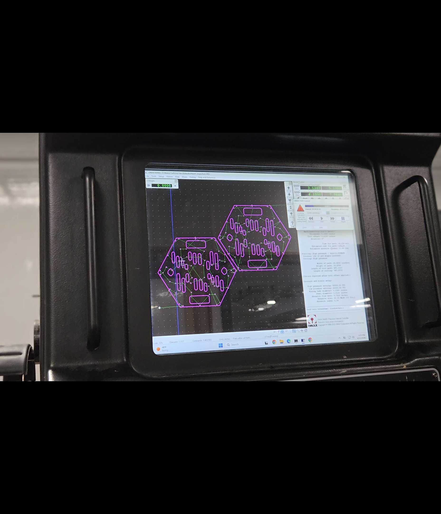

*Figure 5: Waterjet-cut 6061-T6 aluminum chassis plates — hexagonal top and bottom plates with weight reduction cutouts. Photo: Mechanical Team.*

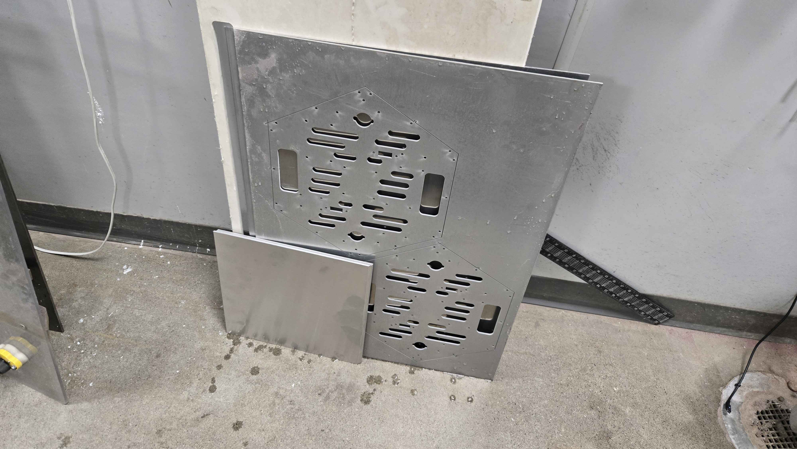

#### CNC Milling

CNC milling was provided by our industry sponsor, **Monode Marking Products**. Monode machined our parts using their in-house CNC equipment, with each part typically taking a couple of hours to complete.

#### 3D Printing (FDM)

All internal components were 3D printed using **standard PLA filament**. Prototypes were printed at **15% infill** for rapid iteration, while final internal parts and backup/replacement components were printed at **solid (100%) infill** for maximum strength and durability.

#### Physical Assembly

The following photos document the build progression of Spinlayden 2.0 — from electronics mounting on the waterjet-cut 6061 aluminum bottom plate through full-chassis wiring integration. To avoid losing schedule time while waiting on the CNC shop, the team 3D-printed a full set of placeholder perimeter walls and a top plate in PLA so that wiring, component fitment, and layout could be validated in parallel with external machining. The images also show the 3D-printed PLA internal components (battery bracket, Pi/IMU housing) in their final mounted positions.

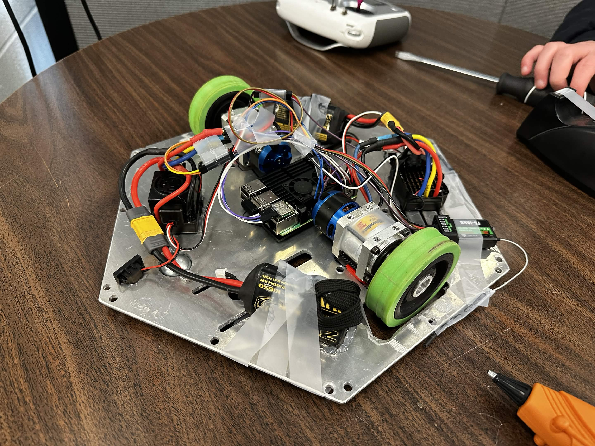

*Figure 15: In-progress assembly — waterjet-cut 6061 aluminum bottom plate with the Raspberry Pi 4B, dual EZRUN MAX10 ESCs, BaneBots P61 gearboxes, green BaneBots drive wheels, and battery XT90 interconnects mounted prior to perimeter wall installation. Photo: Mechanical Team.*

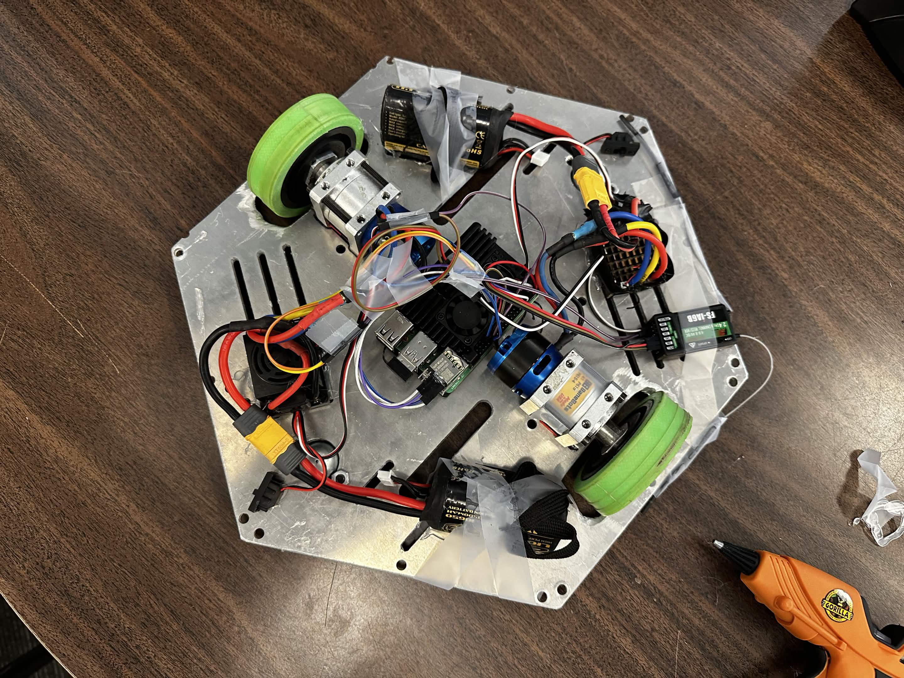

*Figure 15b: Top-down view of the same assembly stage showing the symmetric electronics and drive layout around the central Raspberry Pi housing. Photo: Mechanical Team.*

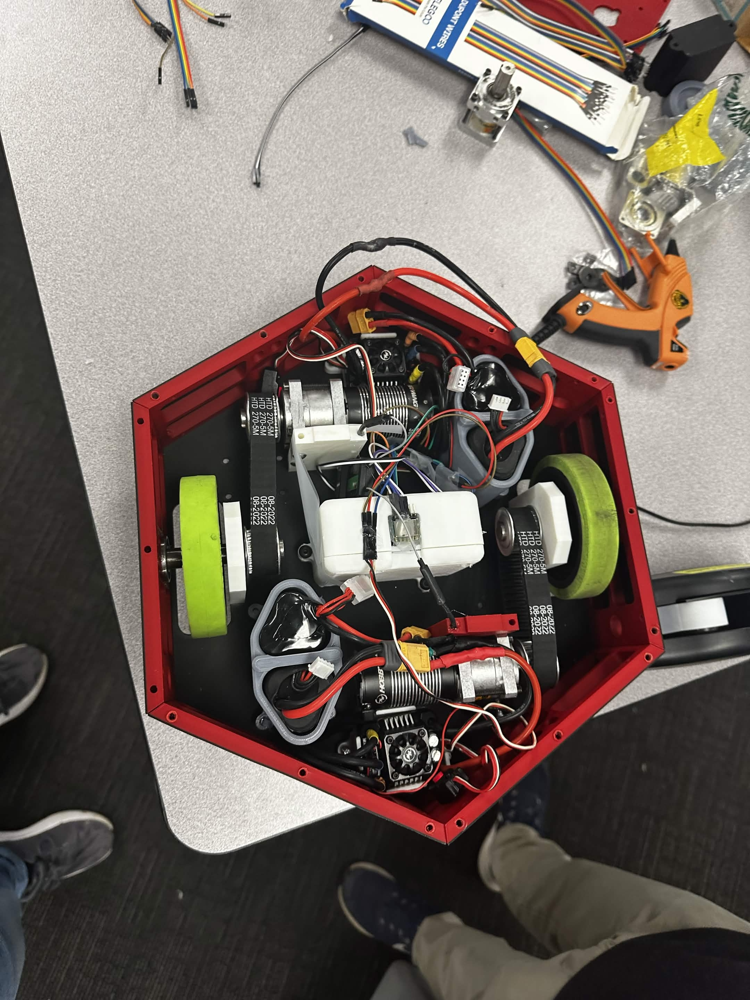

*Figure 16: Wiring-integration assembly — the red and black perimeter walls are 3D-printed PLA placeholders, printed in-house so the team could validate electronics layout, wiring routing, and component fitment in parallel with the CNC-milled aluminum walls being fabricated off-site. Top plate removed for internal view. Final positioning of the dual BaneBots gearboxes, drive wheels, and the central Pi/IMU control stack is identical to the end-state aluminum build. Photo: Mechanical Team.*

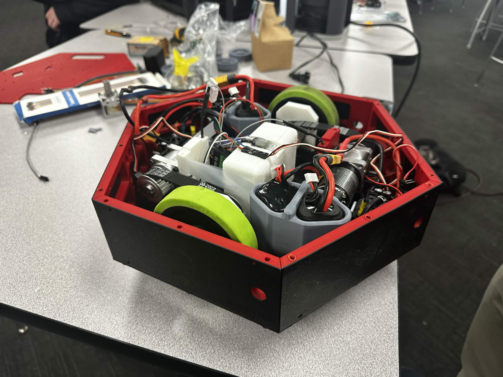

*Figure 16b: Angled view of the same wiring-integration build — every colored wall panel, the top plate, the white battery bracket, and the Pi/IMU housing visible here are 3D-printed PLA parts. The colored walls and top plate are placeholders that will be swapped out for the anodized 6061 aluminum parts once they return from the CNC shop; the internal brackets (battery, Pi/IMU) are final flight hardware, printed at 100% infill per the internal-components fabrication spec. Photo: Mechanical Team.*

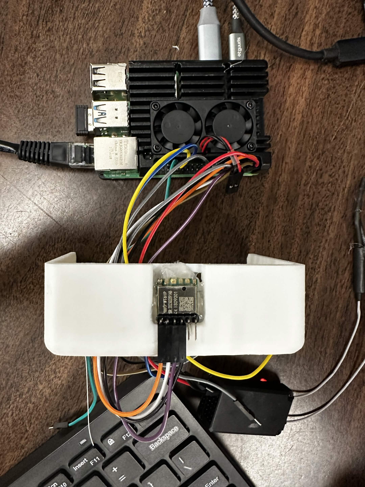

*Figure 16c: Detail view of the 3D-printed PLA IMU mounting bracket supporting the WT901 9-axis IMU directly beneath the Raspberry Pi 4B — the printed enclosure provides a rigid, vibration-isolated mount for the gyroscope during high-RPM operation. Photo: Software Team.*

### Inventory

The following table lists the tools and equipment available to Riverside Robotics for fabrication, assembly, and maintenance of Spinlayden. Keeping an accurate inventory ensures the team can plan work sessions effectively and identify when replacements or additional tools are needed.

**Table 9:** Tools and Equipment Inventory

| Item | Quantity | Type | Condition |
|------|----------|------|-----------|
| DeWalt Drill | 1 | Power Tool | Good |
| DeWalt Impact Driver | 1 | Power Tool | Good |
| Ryobi Drill | 1 | Power Tool | Functional (bad battery) |
| Hex Allen Key Set | Multiple | Hand Tool | Good |
| Pliers (assorted) | Multiple | Hand Tool | Good |
| Drill/Impact Bit Sets | Multiple | Accessories | Good |
| Wrench Set (assorted) | Multiple | Hand Tool | Good |
| Lunyee 3018 Pro Ultra CNC Machine (500W) | 1 | CNC Equipment | Good |
| 3D Printer (PLA/PETG/TPE capable) | 1 | 3D Printing | Good |
| Soldering Iron | 1 | Electronics | Good |
| Polycarbonate Safety Glasses | 12 | Safety | New |
| ANSI A5 Polyurethane Coated Work Gloves | 12 | Safety | New |

### Data Management

Team Meltdown uses a combination of version-controlled repositories, cloud storage, and collaborative design platforms to manage all project files and ensure that every team member has access to the latest versions of our work.

**Software and Documentation — GitHub**
All control software for Spinlayden 2.0 is maintained in a dedicated GitHub repository. The codebase is version-controlled using Git, allowing the software team to track changes, revert to previous versions, and collaborate without overwriting each other's work. A separate GitHub repository is used for all competition documentation, including this document, meeting notes, team biographies, and supporting files. Using Git for documentation ensures a complete revision history and makes it easy to identify who contributed what and when.

**CAD Models — Autodesk Fusion 360 Shared Hub**
All mechanical design work is done in Autodesk Fusion 360. The design team operates within a shared Fusion 360 hub, giving all members access to the latest version of every part, assembly, and drawing. Fusion 360's built-in version history tracks each iteration of every component, making it straightforward to compare revisions or roll back changes if a design modification does not perform as expected.

**General File Sharing — Shared Drive**
For files that do not fit neatly into a code repository or a CAD platform — such as reference images, sponsor logos, budget spreadsheets, and rubric documents — the team uses a shared drive folder. This central location ensures that non-technical files are accessible to all team members regardless of which subteam they belong to.

This multi-platform approach ensures that each type of project data lives in the tool best suited to manage it, while keeping everything accessible and version-tracked for the full team.

---

## Design Process

### Research

**Configuration:** The structural configuration of the robot

**Strengths:**

- The bot can still move when flipped over

**Weaknesses:**

- Raspberry Pi integrated into the robot chassis for onboard controller processing, introducing additional points of failure (in previous seasons, only a radio receiver was housed internally)

### Strategy

#### Offensive Strategies

- Rush opponents at 1-2 ft/s using ~0.75 hp motors to seize control and force reactive defenses
- Spin at 645.6 RPM to deflect attacks with a ~26.9 mph bolt barrier, priming for counterstrikes
- Strike with 15-lb spinning mass and six impact bolts (~78 J/rotation) to exploit opponent vulnerabilities
- Sustain 645.6 RPM spins and agile steering to keep opponents defensive and disoriented
- Recover from flips in ~2 seconds using double-sided design to resume aggressive maneuvers

#### Defensive Strategy

- Spin at 645.6 RPM to generate a 20–30 mph perimeter steel barrier, deflecting attacks and protecting internal components
- Accelerate at 1-2 ft/s to retreat if needed from opponents, gaining time to recover and spin up
- Utilize weight reduction cutouts in 6061 aluminum chassis for passive airflow during rotational operation
- Maintain rotational velocity via two-motor drive system while maneuvering, minimizing stationary vulnerabilities. Two operators — one for drivetrain control and one for system mode management.
- Operate effectively when flipped using double-sided design, reducing downtime from impacts

### Overview

Spinlayden 2.0 is a 15-pound meltybrain full-body spinner designed for the AWT Regional RoboBots Competition. The robot builds on the foundation established by Spinlayden 1.0 during the 2025 season, addressing every major weakness identified during that campaign while retaining the core hexagonal meltybrain concept that proved viable in competition. The chassis is machined from 6061-T6 aluminum and carries six 1/2" carbon steel hex bolts threaded through its perimeter walls as impact weapons, delivering approximately 78 joules of kinetic energy per rotation at a spin rate of 645.6 RPM. A Raspberry Pi 4B running custom C# control software processes IMU data from a WT901 gyroscope to enable simultaneous rotation and translation — the defining capability of a meltybrain drive system. Key improvements over the previous design include partial-depth weight reduction pockets replacing through-holes, repositioned internal components for better impact protection, a dedicated 3D-printed Raspberry Pi housing, 1/2" carbon steel hex bolt weapons replacing the previous blade system, and a 2.4 GHz radio link replacing the unreliable Bluetooth connection.

### Key Stats

- **Weight:** 15 lbs
- **Weapon Speed:** 645.6 RPM (~26.9 mph tip speed)
- **Motor Power:** ~0.75 hp (drive and weapon combined)
- **Translational Speed:** 1-2 ft/s while spinning
- **Material:** 6061 aluminum chassis, 1/2" carbon steel hex bolts (impact weapons)
- **Impact Bolts:** 6 × 1/2" carbon steel hex bolts, one per chassis face
- **Torque:** ~5 Nm per drive motor (estimated, 21:1 reduction)

### Analysis and Conceptualization

We began by analyzing the previous iteration of the robot from the 2025 season. Using the original design as a reference platform, the team identified and addressed the deficiencies and failure modes present in last year's design.

With the Robotics program expanding significantly in membership — from 8 students last season to a 19-student high school roster this year plus two middle school JuniorBots teams — Team Meltdown set out to build on the previous design. After forming the team, we took several measures:

- Watched previous AWT competitions and noted the performance of other bots and on what design they relied on
- Reviewed the prior Riverside design and analyzed the most significant obstacles and problems
- Whiteboarded various ideas, as well as comparing their advantages and weaknesses
- Started a basic CAD design in Fusion 360 that we could build on over the season

*Figure 6: Early hand-drawn concept sketch of Spinlayden 2026 — exploring chassis geometry, wall count, and proposed new components (gearboxes, shelling) before moving into CAD. Sketch: Design Team.*

### Design Motivation

Spinlayden's design is driven by the goal of delivering maximum damage while maintaining mobility and resilience. The 14" x 12" hexagonal chassis, crafted from 1/8" 6061 aluminum with cutouts on the inner half of the walls to reduce weight, allows us to spin at 645.6 RPM.

The Melty-Brain system, powered by two EZRUN 3660 SL G2 motors, combines high torque with precise control via Raspberry Pi 4B, running a C# program that utilizes the physics from the OpenMelt project on GitHub, allowing Spinlayden to spin as both a weapon and a shield, while still being able to move at the same time.

Six 1/2" carbon steel hex bolts are threaded through the outer walls of the chassis — one per face — to deliver impact damage (estimated 78J per rotation from the full spinning mass) without compromising the 15-lb weight limit.

### Research Methods

We started by analyzing previous AWT competitions and even other competitions/streams online. We analyzed the success, strengths, and weaknesses of our own bots and other teams.

### Refinement

Throughout the design process, Spinlayden 2.0 underwent several key refinements based on lessons learned from Spinlayden 1.0:

**Weight Reduction Redesign:** The original weight reduction holes weakened the chassis walls at stress points. For 2.0, we redesigned the cutout geometry to remove material only from the inner half of the walls, preserving structural integrity at the edges where impacts occur.

**Component Repositioning:** In 1.0, internal components (batteries, ESCs, Pi) were mounted too close to the outer walls, making them vulnerable to hits that deformed the chassis inward. The 2.0 layout moves components closer to the center of the bot.

**Weapon Redesign:** The original machined blade-style weapons were replaced entirely. Spinlayden 2.0 uses 1/2" carbon steel hex bolts threaded through the chassis walls — a simpler, more robust approach that delivers brute-force impact through the bolt tip and shank and allows for fast field replacement with standard hardware.

**Dedicated Raspberry Pi Housing:** The Pi was unprotected in 1.0, leaving the control system exposed. A dedicated 3D-printed housing now shields the Pi from impacts and vibration.

**Software Rewrite (Python → C#):** The original Python meltybrain software suffered from input lag due to Python's interpreted execution. The team rewrote the control system in C# for compiled performance and reduced latency.

**Controller Upgrade (Bluetooth → 2.4 GHz):** The Bluetooth controller used in 1.0 experienced frequent connection drops during matches. We switched to a 2.4 GHz radio controller with a USB receiver for more reliable communication.

**Counterweight Removal:** The 1.0 design used counterweights to balance the spinning chassis, adding complexity and weight. The 2.0 design achieves balance through symmetric component placement, eliminating the need for dedicated counterweights.

**3D Printed Prototyping:** Before cutting metal, we 3D printed prototype wall sections and assemblies to verify fit, test component clearances, and catch design issues early.

### Risk Analysis

In addition to the component-level failure analysis (FMEA) below, the team identified project-level risks that could affect the schedule, manufacturing process, or competition outcome. The following risk matrix assesses each risk by severity and likelihood on a 1–10 scale and documents the mitigation strategy in place.

**Table 11:** Project-Level Risk Matrix

| Risk Category | Risk | Cause | Impact | Severity (1-10) | Likelihood (1-10) | Mitigation |
|---------------|------|-------|--------|-----------------|-------------------|------------|
| Schedule | Documentation not completed by deadline | Large scope (35 rubric sections), limited time, 8 bios still pending | Incomplete submission reduces rubric score | 7 | 5 | Rubric compliance tracker created to prioritize high-impact sections; documentation work began early in the season; TODO items assigned to specific team members |
| Schedule | Testing not completed before competition | Robot assembly delays push testing window past April 24 | Bot enters competition without full-speed validation | 8 | 4 | Four-phase testing plan started April 14; critical tests (spin-up, drive, weapon) prioritized first; low-speed validation already complete |
| Manufacturing | Loss of machining access | External manufacturing partners (Monode, Case Western think[box]) become unavailable | Cannot fabricate precision chassis components | 9 | 3 | Relationships established early in season; backup CNC available (Lunyee 3018 Pro Ultra) for smaller parts; waterjet cutting completed ahead of schedule |
| Manufacturing | 3D-printed components fail under combat loads | PLA/PETG parts crack or deform from vibration or impact | Internal mounts or Pi housing break during match | 5 | 5 | 3D-printed parts used only for non-structural internal mounts; critical structural components machined from aluminum or steel; spare printed parts prepared in advance |
| Manufacturing | Parts arrive late or incorrect | Vendor shipping delays or ordering errors | Build schedule slips; team cannot assemble on time | 7 | 4 | Parts ordered early in the season; owned inventory from Spinlayden 1.0 covers critical drive and power components; budget includes margin for expedited replacements |
| Competition | Opponent exploits exposed wheels | Wheels extend slightly beyond chassis perimeter | Wheel damage disables drivetrain; bot cannot translate | 7 | 6 | BaneBots wheels are inexpensive and quick to replace between matches; spare wheels and gearboxes on hand; bot can still spin as a weapon even without drive |
| Competition | Match loss due to control errors | Operator inexperience with meltybrain driving or mode switching | Bot drives into walls, fails to engage, or wastes match time | 6 | 5 | Two-operator system splits driving and mode management; practice sessions scheduled during April testing window; operators trained on Spinlayden 1.0 last season |
| Competition | Battery depletion mid-match | High current draw from four motors at full spin | Bot loses power before 3-minute match ends | 8 | 3 | Six Liperior 2700 mAh 4S LiPo batteries available; battery endurance testing planned to confirm runtime exceeds match duration; fresh battery loaded before each match |

### Structural Analysis

To evaluate the durability and reliability of Spinlayden 2.0, the team conducted a Failure Modes and Effects Analysis (FMEA). This systematic approach identifies potential failure points, assesses their severity and likelihood, and documents the mitigations designed into the bot.

**Table 10:** Failure Modes and Effects Analysis (FMEA)

| Component | Failure Mode | Cause | Effect | Severity (1-10) | Likelihood (1-10) | Mitigation |
|-----------|-------------|-------|--------|-----------------|-------------------|------------|
| Impact Bolts | Loosening during spin | Vibration at 645.6 RPM | Bolt becomes projectile; bot loses weapon mass | 9 | 4 | Loc-Tite thread locker applied to all impact bolt threads; jam-nut configuration to prevent back-off under vibration |
| Impact Bolts | Bending or deformation | Repeated high-energy impacts | Reduced damage output; potential rotational imbalance | 5 | 4 | 1/2" carbon steel selected for strength under impact; spare bolts available for quick swap between matches |
| Side Walls | Deformation inward | Direct hit from opponent weapon | Internal components damaged; spin impeded | 8 | 6 | 3/8" 6061-T6 aluminum walls; weight reduction cutouts only on inner half to preserve edge strength; components repositioned away from walls |
| Side Walls | Interlocking joint failure | Repeated impacts at joint seams | Wall separation; structural integrity loss | 7 | 4 | Bolt-reinforced interlocking joints; hexagonal geometry distributes loads across all six panels |
| Control System | Software crash | Unhandled exception or memory issue | Loss of bot control during match | 9 | 3 | C# rewrite provides compiled stability over interpreted Python; dedicated Pi housing reduces vibration-induced errors |
| Control System | Radio signal loss | Interference or receiver damage | Bot spins uncontrolled or stops | 9 | 3 | Upgraded from Bluetooth to 2.4 GHz radio with USB receiver; improved range and interference resistance |
| Drivetrain | Motor burnout | Sustained high-current draw or stall | Loss of drive on one side; bot cannot translate | 7 | 3 | EZRUN MAX10 SCT ESCs rated for 120A continuous / 830A peak; heat dissipation through chassis ventilation |
| Drivetrain | Gearbox failure | Impact shock transmitted through wheels | Loss of drive; wheel free-spins | 6 | 4 | BaneBots P61 20:1 planetary gearboxes rated for combat loads; 1045 carbon steel output shafts |

### CAD Models

The full Spinlayden 2.0 assembly was modeled in Autodesk Fusion 360 using the shared team hub, allowing multiple students to contribute to individual components in parallel. The complete assembly includes the hexagonal chassis (top, bottom, and six perimeter walls), four EZRUN brushless drive motors with BaneBots P61 gearboxes, two BaneBots drive wheels with shafts and bearings, six Liperior 4S LiPo batteries, two EZRUN MAX10 SCT ESCs, the Raspberry Pi 4B in its dedicated 3D-printed housing, the WT901 IMU, and the six 1/2" carbon steel hex bolt impact weapons threaded through the perimeter walls.

*Figure 7: Spinlayden 2.0 — Full isometric CAD render showing hexagonal chassis with blue top plate, six 1/2" carbon steel hex bolt impact weapons, green BaneBots drive wheels, four motors, batteries, and central Raspberry Pi housing. CAD: Design Team.*

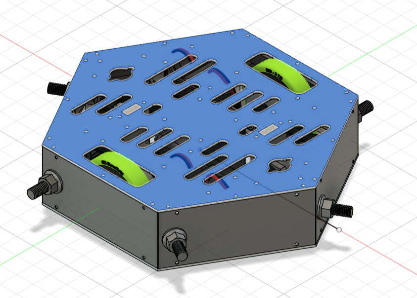

*Figure 8: Spinlayden 2.0 — Alternate isometric view with standard aluminum finish, showing chassis bolt heads, 1/2" carbon steel hex bolt impact weapons threaded through the perimeter walls, and wheel clearance at the chassis corners. CAD: Design Team.*

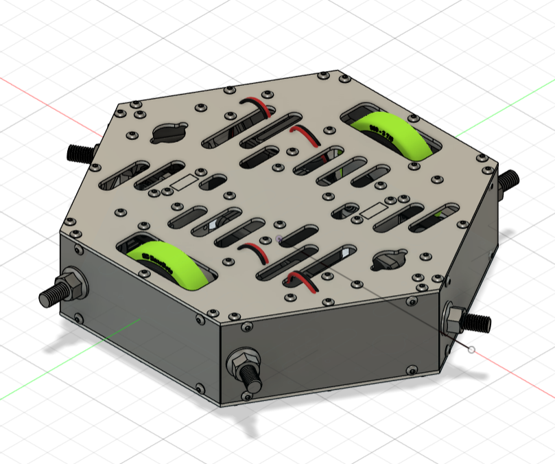

*Figure 8b: Spinlayden 2.0 — Interior CAD view with the top plate removed, showing the internal layout of the dual BaneBots gearboxes, drive motors, 3D-printed battery bracket, Pi/IMU housing, and drive wheels mounted on the waterjet-cut 6061 aluminum bottom plate. CAD: Design Team.*

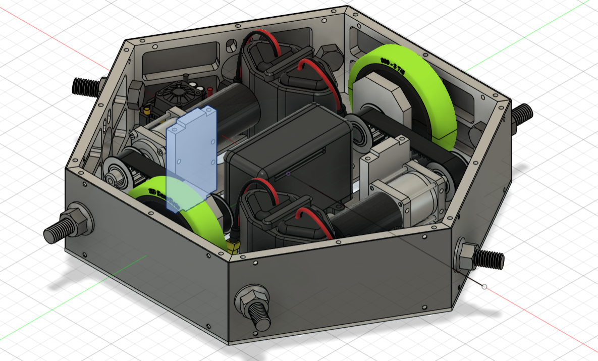

### Engineering Drawing Set

Dimensioned mechanical drawings for the primary fabricated parts of Spinlayden 2.0 were produced in Autodesk Fusion 360 by Robby Rateno (Wall, Gearbox Mount, Bearing Mount — 3/3/2026) and Adam Pakeltis (Top-Bottom Plate — 4/18/2026). Each drawing is provided at 1:1 scale with tolerances suitable for CNC milling and waterjet cutting.

**Wall Plate** — the perimeter wall panel of the hexagonal chassis. Six of these are arranged around the bot, providing the primary impact surface. Overall size: 6.88" × 2.91"; thickness: 3/8". Features four rectangular weight-reduction pockets on the inner half only (to preserve edge strength at impact zones) and mounting bolt patterns for the top and bottom plates.

*Figure 9: Wall plate CAD render and dimensioned drawing. CAD: Design Team.*

*Figure 9a: Wall plate — dimensioned drawing (1:1 scale, Size B) by Robby Rateno, 3/3/2026*

**Gearbox Mount** — brackets that secure the BaneBots P61 gearboxes to the interior of the chassis. Overall footprint: 3.16" × 1.96"; thickness: 3/8". Features slotted mounting holes (±0.19" adjustment) for belt-tension alignment and a pair of 0.15" through-holes for the gearbox fasteners.

*Figure 10: Gearbox mount CAD render and dimensioned drawing. CAD: Design Team.*

*Figure 10a: Gearbox mount — dimensioned drawing (1:1 scale, Size B) by Robby Rateno, 3/3/2026*

**Bearing Mount** — the rotary shaft bearing housing that supports the drive shaft between the chassis walls. Overall size: 2.13" × 2.78"; thickness: 0.38". Features a 1.13" diameter bore for the bearing and a 135° chamfer at the corner to clear interior components during assembly.

*Figure 11: Bearing mount CAD render and dimensioned drawing. CAD: Design Team.*

*Figure 11a: Bearing mount — dimensioned drawing (1:1 scale, Size B) by Robby Rateno, 3/3/2026*

**Top-Bottom Plate** — the hexagonal chassis plate used for both the top and bottom of the bot (identical geometry, so a single drawing covers both parts). Waterjet-cut from 1/8" 6061-T6 aluminum on the OMAX 5555 at Case Western think[box]. Overall length: 13.86" across flats; thickness: 0.13". Features a dense pattern of weight-reduction slots (all interior-radius 0.15"), wheel-well cutouts with an end-to-end length of 3.464", mounting bolt holes, and component pass-throughs for the drive and electronics stack. See the full dimensioned drawing for slot spacing, mounting hole locations (Ø.16), and corner radii (R.25 / R.5 / R.15).

*Figure 11b: Top-Bottom Plate — top-down CAD render showing the full slot pattern, wheel-well cutouts, perimeter bolt holes, and central access windows. CAD: Design Team.*

*Figure 11c: Top-Bottom Plate — dimensioned drawing (1:1 scale, Size A) by Adam Pakeltis, 4/18/2026. Covers both the top and bottom hex plates (identical geometry).*

[Full-resolution PDF for 1:1 print: `Images/Engineering Drawings/Finalized Spinlayden Top-Bottom Plate Drawing.pdf`](Images/Engineering%20Drawings/Finalized%20Spinlayden%20Top-Bottom%20Plate%20Drawing.pdf)

### Weapon System Details

Spinlayden 2.0 is a full-body spinner — the entire robot is the weapon. The hexagonal chassis spins at 645.6 RPM, creating a steel barrier with a tip speed of approximately 26.9 mph.

**Impact Bolts:**
- **Quantity:** 6 × 1/2" carbon steel hex bolts, one threaded through each face of the hexagonal chassis
- **Material:** 1/2" carbon steel — selected for strength and impact resistance, with fast field replaceability using standard hardware
- **Mounting:** Each bolt threads through a hole in the chassis wall with Loc-Tite thread locker and a jam-nut configuration to prevent loosening from vibration during spin

**Energy Output:**
- **Kinetic Energy:** Approximately 78 joules per rotation at full RPM
- **RPM:** 645.6 RPM at full speed
- **Tip Speed:** ~26.9 mph at the bolt tips

The full-body spinner design means there is no safe angle to approach Spinlayden. Every face of the hexagon carries an impact bolt, and the spinning mass acts as both weapon and shield simultaneously.

### Drive System Details

Spinlayden 2.0 uses a meltybrain drive system — the bot translates across the arena while spinning as a full-body weapon. This is achieved by pulsing the drive motors in sync with the bot's rotation, using gyroscope data to determine orientation.

**Motors:**
- **Type:** 2x Hobbywing EZRUN 3660 SL G2 brushless motors
- **Application:** One motor per drive side (tank-style steering)

**Electronic Speed Controllers (ESCs):**
- **Type:** 2x Hobbywing EZRUN MAX10 SCT ESCs
- **Rating:** 120A continuous, 830A peak — provides ample headroom for combat stall conditions
- **BEC Output:** Powers the radio receiver and Raspberry Pi

**Gearboxes:**
- **Type:** 4x BaneBots P61 20:1 planetary gearboxes (2 per drive side)
- **Reduction:** 20:1 gear ratio converts high motor RPM to usable torque for the wheels

**Wheels and Hubs:**
- **Wheels:** BaneBots 3-7/8" diameter compliant wheels — provide grip while absorbing impact
- **Hubs:** BaneBots T81 hubs — connect wheels to gearbox output shafts

**IMU / Gyroscope:**
- **Type:** WT901 9-axis IMU/gyroscope (USB, 200 Hz sampling rate)
- **Function:** Provides real-time orientation data to the C# control software, enabling the meltybrain algorithm to determine the bot's rotational position and pulse motors at the correct moment for translational movement

*Figure 12: WT901 9-axis IMU/gyroscope module used for rotational orientation sensing. Photo: Software Team.*

*Figure 12b: WT901 silkscreen — labeled pin header (VCC, SCL, SDA, GND, RX, TX, D0–D3) and body-frame axes (X, Y, Z) used when wiring the module to the Raspberry Pi. Photo: Software Team.*

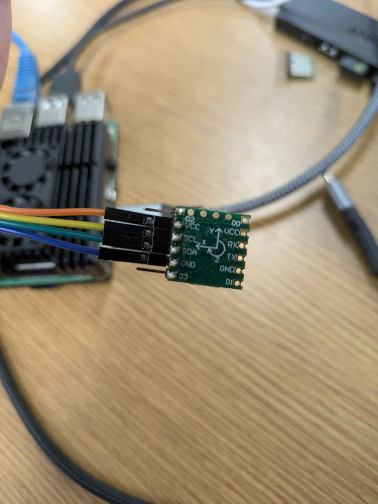

**Shafts and Bearings:**
- **Shafts:** 1045 carbon steel — good balance of strength and machinability for rotary applications
- **Bearings:** R8-2RS sealed bearings — sealed design keeps debris out during combat

**Power Transmission:**
- **Belts:** Dayco V-belts transfer power from motor to gearbox input
- **Steering:** Tank-style differential steering — varying speed between left and right motors while spinning allows translational movement in any direction

### Power System Details

**Batteries:**
- **Type:** 6x Liperior 2700mAh 4S 30C LiPo batteries
- **Voltage:** 14.8V per pack (4S configuration)
- **Connector:** XT60 connectors
- **Configuration:** Batteries are distributed symmetrically within the chassis to maintain rotational balance — critical for a full-body spinner
- **Capacity:** 2700mAh per pack provides sufficient runtime for the 3-minute match format with safety margin

**Safety Systems:**
- **Kill Switches:** 2x MS-05 kill switches mounted on the bot exterior, accessible without reaching into the spinning chassis — required by AWT safety rules for immediate power cutoff
- **Wiring:** All electrical connections soldered with 63-37 tin-lead solder for reliable joints under vibration

**Power Distribution:**
- Batteries feed into the two EZRUN MAX10 SCT ESCs
- Each ESC powers one EZRUN 3660 SL G2 drive motor
- ESC BEC (Battery Eliminator Circuit) output provides regulated 5V power to the radio receiver and Raspberry Pi 4B
- Total system draws approximately 0.75 hp combined motor power

### Wiring Schematic

The electrical system follows this signal and power flow:

**Power Path:**
1. 6x Liperior 4S LiPo batteries (14.8V) → MS-05 kill switches (external cutoff)
2. Kill switches → 2x EZRUN MAX10 SCT ESCs (motor control + power regulation)
3. ESCs → 2x EZRUN 3660 SL G2 brushless drive motors

**Control Path:**
1. 2.4 GHz radio controller (operator) → USB radio receiver mounted on the bot
2. USB receiver → Raspberry Pi 4B (8 GB RAM) — processes controller input
3. Raspberry Pi runs C# meltybrain control software — reads WT901 IMU/gyroscope data to determine bot orientation during spin
4. Pi sends motor speed commands → ESCs → motors pulse in sync with rotation to achieve translational movement

**BEC Power Path:**
- ESC BEC output (regulated 5V) → powers Raspberry Pi and radio receiver — no separate voltage regulator needed

*Figure 13: Raspberry Pi 4B with passive heatsink case and dual cooling fans, showing UART wiring to the WT901 IMU (multicolor dupont leads on the GPIO header). Photo: Software Team.*

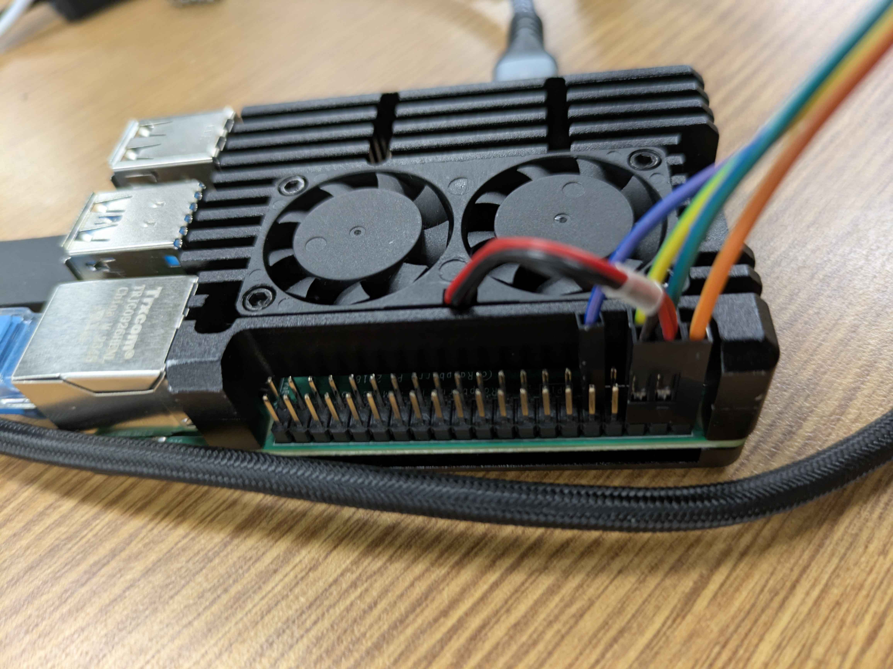

*Figure 13b: WT901 IMU connected to the Raspberry Pi via a 5-wire dupont jumper bundle — the physical link between the gyroscope and the Pi's UART that the control software reads at 200 Hz. Photo: Software Team.*

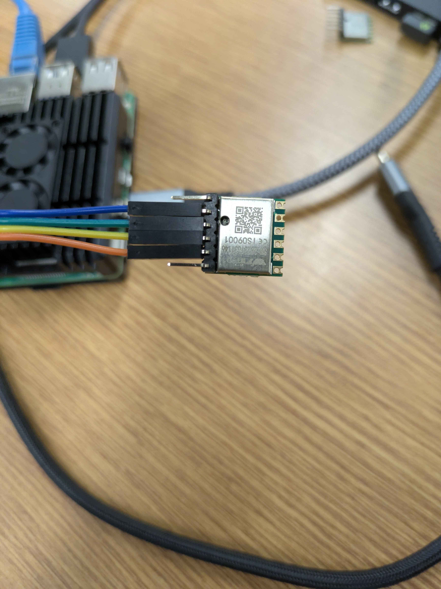

*Figure 13c: Raspberry Pi 4B J8 GPIO pinout reference (Pi4J numbering) — used as the physical pin map when cross-referencing the project-specific GPIO assignments in Figure 14 below. Source: pi4j.com*

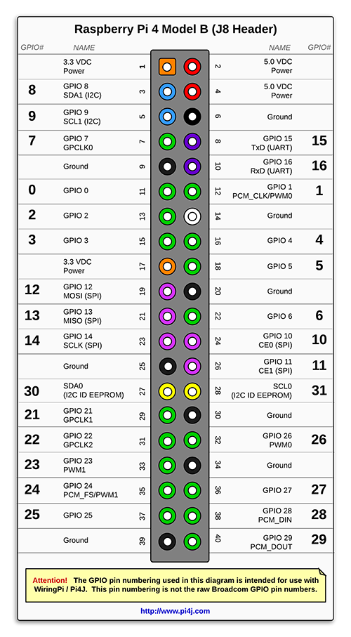

*Figure 14: GPIO pin assignment table mapping the RC receiver channels, WT901 IMU UART, and drive ESC PWM outputs to specific Raspberry Pi 4B GPIO pins — serves as the wiring reference used by the control software. Table compiled by: Software Team.*

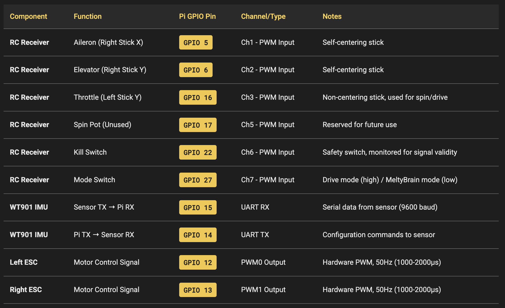

### Testing Results

Testing for Spinlayden 2.0 has been conducted in phases as components became available:

**3D Printed Prototype Testing (February–March 2026):**
- Printed prototype wall sections and assemblies to verify fit and impact bolt clearances before committing to metal fabrication
- Identified and corrected dimensional issues in the CAD model before waterjet cutting

**Low-Power Spin Testing (March 17, 2026):**
- Conducted initial spin tests using a lower-power motor to validate the meltybrain control system
- Verified that the C# software correctly reads gyroscope data and pulses motors in sync with rotation
- Confirmed translational movement works while spinning

**Assembly and Integration Testing (April 3–11, 2026):**
- Assembled metal chassis walls with impact bolt weapon system
- Verified bolt patterns and component fitment in the final metal assembly
- Tested kill switch accessibility and power cutoff functionality

**Planned Testing Before Competition (April 14–24, 2026):**
- Full-speed spin tests with all six impact bolts mounted
- Driving and maneuverability tests in a controlled environment
- Impact testing against test targets to validate bolt impact performance
- Battery endurance test to confirm runtime exceeds 3-minute match requirement

Full-speed spin results, impact-test outcomes, and measured runtime will be compiled into a post-test addendum following the April 14–24 testing window and shared with judges at the competition interview on April 25, 2026.

---

## That's a Wrap!

### Closing Remarks

The Spinlayden 2.0 project represents the collective effort of 19 students, two alumni advisors, and an industry mentor working together over the course of seven months to design, manufacture, and document a competitive combat robot. What began as a second-year rebuild of an unproven concept has grown into a fully engineered machine backed by detailed analysis, professional manufacturing partnerships, and a team that has more than doubled in size since last season.

This process has taught our team far more than how to build a robot. Students gained hands-on experience with waterjet cutting, CNC milling, 3D printing, soldering, and mechanical assembly. They learned to read engineering drawings, manage a bill of materials, conduct failure analysis, and write technical documentation to a professional standard. Members of the software team rewrote an entire control system from Python to C#, learning about real-time processing, IMU integration, and wireless communication along the way. Every student on Team Meltdown leaves this season with skills and experience that will serve them in college, careers, and beyond.

We are proud of what we have built — not just the robot in the arena, but the program around it. Riverside Robotics is stronger than it has ever been, and we look forward to competing at the AWT Regional RoboBots Competition on April 25, 2026. Win or lose, Spinlayden 2.0 is proof of what a dedicated team can accomplish when given the tools, the mentorship, and the opportunity to build something real.

Thank you for reading our documentation. See you in the arena.
